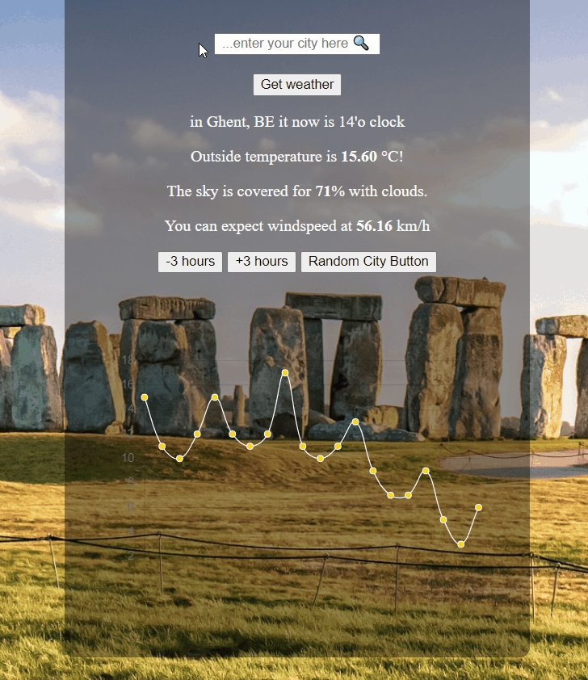

# readme-gif
 
## I gave a watch (info-session) on how to add gif to your README.
Fairly simple!

`` ``

Size them up!

##Program
I used ScreenToGif to make the gifs. 
Useful tool! 
I heard GiFox is good for Mac.
